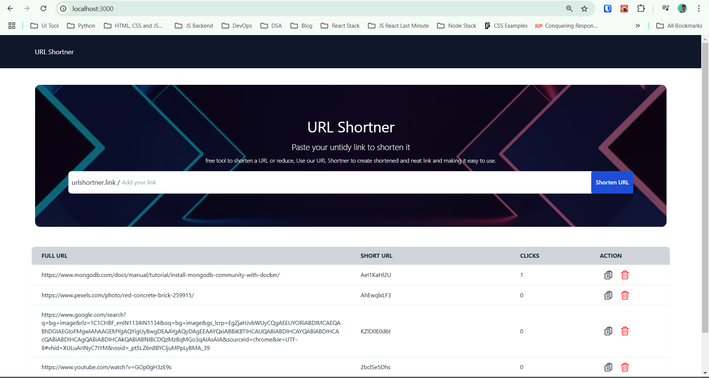

## This is a simple URL Shortening application

Built using React, Typescript, tailwindCSS, axios for the Frontend

And express, mongoDB, mongoose and nanoID for the backend.

This app has features for deleting, copying URL and also direct navigation when clicked on the short URL.

[Click here for the backend code](https://github.com/iam-rahul-sah/url-shortner-server)

Run this app using `npm run dev` or `yarn dev` this application runs on port 3000 by default.

Start your server before starting the client application.